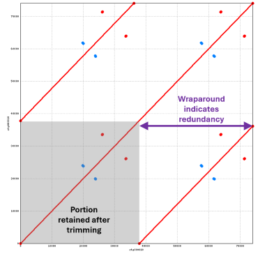

# Manually trim terminal redundancy from over-circularized contigs

## Requirements

Before running this step, you need to have generated multiple independent assemblies of the genome of interest, saved each contig of each assembly as a separate .fasta file, and then used nucmer to perform self-alignments of each contig (as done in lines 296-337 of [this](02_ONT_sub_assemb_nucmer.sh) script ).

### Software needed
* text editor (e.g., GNU nano)
* bedtools (https://bedtools.readthedocs.io/en/latest/) 
</br>

## General notes

There are two approaches for trimming:

1. **Pre-Trycycler Trimming:** Inspect the self-alignment .png and .coords files for each contig for each assembly and manually trim contigs to remove terminal redundancy *before* proceeding with Trycycler. This gives you an opportunity to visualize assembly issues before continuing.
2. **Mid-Trycycler Trimming:** Procede with Trycycler clustering and reconciliation without trimming anything first and see which contigs Trycycler flags as being problematic. Oftentimes the terminal redundancy is small enough that Trycycler will automatically remove the redundancy for you (i.e., region is shorter than the --max_trim_seq and --max_trim_percent thresholds), such that fewer contigs require manual trimming.

_This is an example of a .png dot plot indicating terminal redundancy (purple arrows). The shaded box indicates the region that will remain after trimming the contig._



Either approach is valid. Approach 1 gives you an opportunity to visualize assembly issues before spending time performing Trycycler clustering and reconciliation that may fail, but Approach 2 is likely to be more time efficient. The steps for both approaches are separately outlined below.  
</br>


## Procedure for Pre-Trycycler Trimming
**Step 1:** Assuming the nucmer self-alignment was performed on a remote machine, copy all nucmer graphs for each assembly for each genome into a single directory, then export to a local machine.  

**Step 2:** Visualize each .png dotplot to indentify over-circularized contigs.  

**Step 3:** Look at the corresponding .coords file for each over-circularized contig to determine at what coordinate the contig should be trimmed at the 3' end to eliminate the terminal redundancy.  

**Step 4:** Use GNU nano (or another text editor) to generate a .bed file listing the coordinates that should be kept for each contig in a given assembly. 

_Some notes:_
* The .bed file will be applied to the original multi-fasta output from the assembler, so it must include **_ALL_** contigs for that assembly, including those that do not need to be trimmed.
* Trimming is typically only done at the 3' end of the contig, so the start coordinate will remain 1 for all contigs (specified in the second column).
* .bed file columns can be separated by spaces or tabs.
* The contig names specified in the first column _**must match**_ those in the original multi-fasta file for that assembly.
* *[Optional]* The .bed file can contain a fourth column specifying how you want the contigs to be named after trimming; for example, "*_trim*" can be appended specifically to the names of the trimmed contigs to easily distinguish which contigs were trimmed and which were not. Omit this fourth column if you do not want to rename any contigs.

**.bed file format:** 
```
original_contig_1_name     1     original_end_coordinate    original_contig_1_name
original_contig_2_name     1     new_end_coordinate         contig_1_name_trim
original_contig_3_name     1     new_end_coordinate         contig_2_name_trim
etc... 
```  


**Step 5:** On the machine where assembly was performed, use bedtools to trim the original multi-fasta file to keep only those coordinates sepcified in the .bed file.

*The new trimmed assembly is given a new name and the original untrimmed assembly is preserved.*

```
bedtools getfasta -fi /<fullpath>/<original_assembly_name>.fasta -fo /<fullpath>/<trimmed_name>.fasta -bed /<fullpath>/<file_name>.bed 
```

</br>


## Procedure for Mid-Trycycler Trimming
*This procedure assumes you have already performed contig clustering of your assemblies.*

**Step 1:** Run Trycycler reconcilliation and identify which contig(s), if any, have pairwise relative sequence lengths that fail the  --max_length_diff threshold during the initial check.

**Step 2:** Compare the sequence lengths of all contigs in the cluster and examine the self-alignment .png dotplots to determine which contig(s) have 3' terminal redundancy.

**Step 3:** Look at the corresponding .coords file for each over-circularized contig to determine at what coordinate the contig should be trimmed at the 3' end to eliminate the terminal redundancy.

*If there is no evident terminal redundancy in a problematic contig, it may be necessary to exclude the contig entirely; please reference the Trycycler documentation for details.*

**Step 4:** Use GNU nano (or another text editor) to generate a contig-specific .bed file listing the coordinates that should be kept for each contig requiring trimming in the cluster.

_Some notes:_
* The .bed file will be applied to the individual contig within the Trycycler cluster so will comprise only a single line
* Trimming is typically only done at the 3' end of the contig, so the start coordinate will be 1 (specified in the second column).
* .bed file columns can be separated by spaces or tabs.
* The contig name specified in the first column _**must match**_ that in the Trycycler cluster directory.
* *[Optional]* The .bed file can contain a fourth column specifying how you want the contigs to be named after trimming; for example, "*_trim*" can be appended specifically to the names of the trimmed contigs to easily distinguish which contigs were trimmed and which were not. Omit this fourth column if you do not want to rename any contigs.

**.bed file format:** 
```
trycycler_contig_name     1     new_end_coordinate    trycycler_contig_name_trim
```  
</br>

**Step 5:** On the machine where assembly was performed, use bedtools to trim each over-circularized contig to keep only those coordinates sepcified in the corresponding .bed file.

*The new trimmed contig file is given a new name and the original untrimmed contig file is preserved.*
```
bedtools getfasta -fi /<fullpath>/<original_assembly_name>.fasta -fo /<fullpath>/<trimmed_name>.fasta -bed /<fullpath>/<file_name>.bed 
```
*Remove the index files generated by bedtools so as to avoid possible confusion later (the indexes are for untrimmed files).*
```
rm /<fullpath>/*.fai 
```

**Step 6:** Add ".untrimmed" to the end of the original .fasta file names so that these are no longer recognized by Trycycler during reconcilication.

**Step 7:** Rerun Trycycler reconciliation (all contigs should now pass the initial relative length check)
